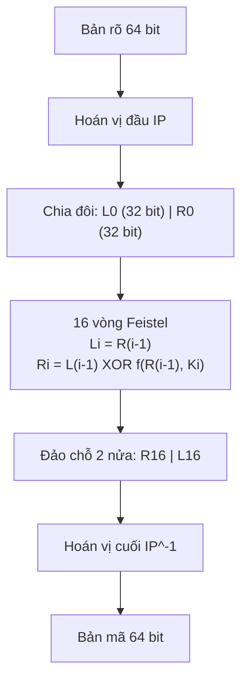
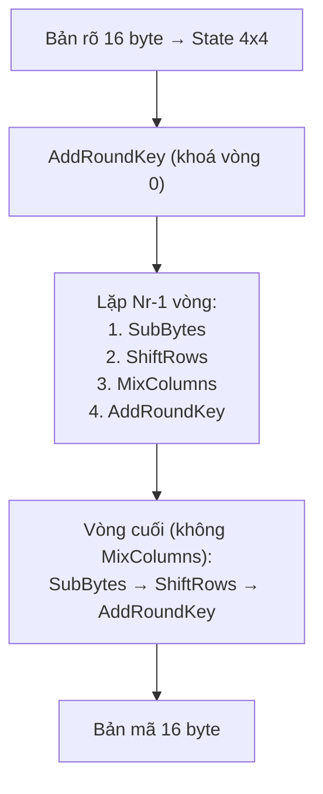
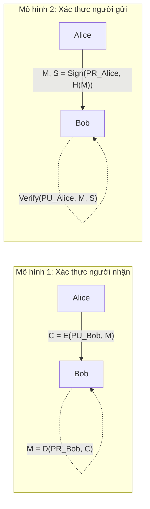
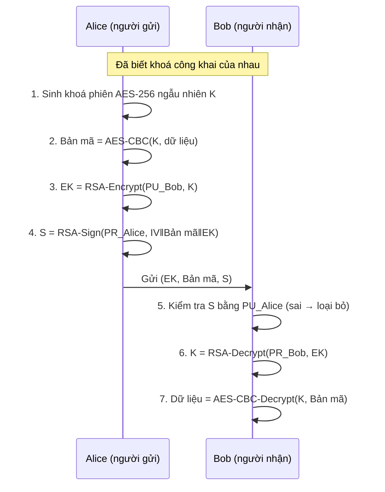

# Bài tập an toàn và bảo mật thông tin

**Họ và tên**: Nguyễn Thu Hằng

**Lớp**: K59.KMT.K01

**MSSV**:K235480106088

# Tìm hiểu DES, AES, RSA và mã hoá lai RSA + AES

> Bài thực hành môn **An toàn và bảo mật thông tin**
> Ngôn ngữ: Python 3.8+ 

## Mục lục

1. [Cấu trúc repo & cách chạy](#1-cấu-trúc-repo--cách-chạy)
2. [Mã hoá đối xứng hiện đại: DES và AES](#2-mã-hoá-đối-xứng-hiện-đại-des-và-aes)
3. [Mã hoá bất đối xứng RSA và nguyên lý sinh khoá](#3-mã-hoá-bất-đối-xứng-rsa)
4. [Các mô hình áp dụng RSA](#4-các-mô-hình-áp-dụng-rsa)
5. [So sánh tốc độ RSA và AES](#5-so-sánh-thời-gian-mã-hoágiải-mã-rsa-và-aes)
6. [Kết hợp RSA + AES (mã hoá lai)](#6-kết-hợp-sức-mạnh-của-rsa-và-aes-mã-hoá-lai)
7. [Kết luận & lưu ý bảo mật](#7-kết-luận--lưu-ý-bảo-mật)
8. [Tài liệu tham khảo](#8-tài-liệu-tham-khảo)

---

## 1. Cấu trúc repo & cách chạy
```bash
git clone https://github.com/<ten-ban>/<ten-repo>.git
cd <ten-repo>

python my_aes.py                 # in từng bước mã hoá 1 khối AES-128 (ví dụ FIPS-197)
python my_rsa.py                 # ví dụ RSA với số nhỏ p=61, q=53
python rsa_models.py        # 3 mô hình RSA
python hybrid.py            # mã hoá lai; hoặc: python demo_hybrid.py file.pdf
python benchmark.py              # so sánh tốc độ (pip install cryptography để có thêm phần B)
python -m unittest -v test_all   # chạy kiểm thử
```

> Mã nguồn được kiểm tra: AES khớp 3 test vector chuẩn FIPS-197 (128/192/256 bit),
> và chữ ký / bản mã RSA, bản mã AES tương thích chéo với OpenSSL (thư viện `cryptography`).

---

## 2. Mã hoá đối xứng hiện đại: DES và AES

Mã hoá đối xứng dùng **cùng một khoá bí mật** cho cả mã hoá và giải mã. Cả DES và AES là **mã khối** (block cipher): chia dữ liệu thành các khối cố định rồi mã hoá từng khối qua nhiều vòng lặp, mỗi vòng kết hợp hai tính chất của Shannon:

- **Confusion (gây nhiễu)**: làm mối quan hệ giữa khoá và bản mã phức tạp → phép thế (S-box).
- **Diffusion (khuếch tán)**: một bit thay đổi ở bản rõ ảnh hưởng đến nhiều bit bản mã → phép hoán vị / trộn.

### 2.1. DES (Data Encryption Standard)

| Thông số | Giá trị |
|---|---|
| Ra đời | 1977 (chuẩn NIST/FIPS 46) |
| Cấu trúc | **Mạng Feistel** 16 vòng |
| Kích thước khối | 64 bit |
| Kích thước khoá | 64 bit, trong đó 8 bit kiểm tra chẵn lẻ → **56 bit hiệu dụng** |
| Khoá con | 16 khoá con, mỗi khoá 48 bit |

#### Quy trình mã hoá



**Hàm vòng `f(R, K)`** (32 bit vào → 32 bit ra):

1. **Mở rộng E**: 32 bit → 48 bit (nhân đôi một số bit).
2. **XOR** với khoá con Ki 48 bit.
3. **8 hộp thế S-box**: mỗi hộp nhận 6 bit → ra 4 bit (phần phi tuyến duy nhất, tạo *confusion*). Tổng 48 → 32 bit.
4. **Hoán vị P** 32 bit (tạo *diffusion*).

**Sinh khoá con**: 64 bit khoá → hoán vị **PC-1** (bỏ 8 bit chẵn lẻ, còn 56 bit) → chia 2 nửa C0, D0 (28 bit) → mỗi vòng **dịch vòng trái** 1 hoặc 2 bit (theo bảng 1,1,2,2,2,2,2,2,1,2,2,2,2,2,2,1) → hoán vị nén **PC-2** chọn 48 bit → Ki.

#### Quy trình giải mã

Cấu trúc Feistel có tính chất đặc biệt: **giải mã giống hệt mã hoá, chỉ đảo thứ tự khoá con** (K16, K15, …, K1). Không cần cài đặt hàm ngược cho `f`.

#### Điểm yếu

- Khoá 56 bit quá ngắn: vét cạn 2^56 khả năng. Năm 1998 máy "Deep Crack" của EFF bẻ DES trong khoảng 56 giờ; ngày nay chỉ mất vài giờ đến vài ngày trên phần cứng chuyên dụng.
- Khối 64 bit dễ bị va chạm khi mã hoá lượng dữ liệu lớn (tấn công kiểu sinh nhật).
- **Triple DES (3DES)** mã hoá 3 lần (E-D-E với 2 hoặc 3 khoá, độ dài hiệu dụng 112 bit) là giải pháp tạm thời, nhưng chậm và đã bị NIST ngừng cho phép sử dụng. DES/3DES nay chỉ còn ý nghĩa **lịch sử và học tập**.

### 2.2. AES (Advanced Encryption Standard)

AES là thuật toán **Rijndael** (Joan Daemen và Vincent Rijmen), được NIST chọn làm chuẩn năm 2001 (FIPS-197) để thay DES.

| Thông số | Giá trị |
|---|---|
| Cấu trúc | **SPN** (Substitution–Permutation Network), không phải Feistel |
| Kích thước khối | 128 bit (16 byte) |
| Kích thước khoá | 128 / 192 / 256 bit |
| Số vòng Nr | **10 / 12 / 14** tương ứng |
| Trạng thái (state) | ma trận 4×4 byte, xếp theo cột |

Số học của AES nằm trong trường hữu hạn **GF(2⁸)** với đa thức bất khả quy `x⁸ + x⁴ + x³ + x + 1`.

#### Quy trình mã hoá



| Phép biến đổi | Mô tả | Vai trò |
|---|---|---|
| **SubBytes** | Thay từng byte qua S-box: lấy nghịch đảo trong GF(2⁸) rồi biến đổi affine (cộng `0x63`) | Confusion, phi tuyến |
| **ShiftRows** | Hàng 0 giữ nguyên; hàng 1, 2, 3 dịch vòng trái 1, 2, 3 byte | Diffusion theo hàng |
| **MixColumns** | Nhân mỗi cột với ma trận cố định trong GF(2⁸): `[2 3 1 1; 1 2 3 1; 1 1 2 3; 3 1 1 2]` | Diffusion theo cột |
| **AddRoundKey** | XOR state với khoá vòng 128 bit | Đưa khoá vào |

Ví dụ `MixColumns` (một cột `a0..a3`): `b0 = 2·a0 ⊕ 3·a1 ⊕ a2 ⊕ a3`, các dòng còn lại xoay vòng tương tự.

**Mở rộng khoá (Key Expansion)**: từ khoá gốc sinh ra `Nr + 1` khoá vòng. Với từ (word) 32 bit `w[i]`: nếu `i` chia hết cho `Nk` thì `w[i] = w[i-Nk] ⊕ SubWord(RotWord(w[i-1])) ⊕ Rcon[i/Nk]`, ngược lại `w[i] = w[i-Nk] ⊕ w[i-1]` (AES-256 có thêm một bước SubWord ở `i mod 8 = 4`).

#### Quy trình giải mã

Áp dụng các phép **ngược** theo thứ tự ngược lại, dùng khoá vòng từ cuối về đầu:

```
AddRoundKey(K_Nr)
lặp Nr-1 vòng:  InvShiftRows → InvSubBytes → AddRoundKey → InvMixColumns
vòng cuối:      InvShiftRows → InvSubBytes → AddRoundKey(K_0)
```

`InvMixColumns` dùng ma trận `[14 11 13 9; 9 14 11 13; 13 9 14 11; 11 13 9 14]`.

#### Chế độ hoạt động (CBC)

Một khối AES chỉ mã hoá được 16 byte. Để mã hoá dữ liệu dài phải chọn **chế độ hoạt động**. Repo cài **CBC**: mỗi khối bản rõ được XOR với khối bản mã trước đó rồi mới mã hoá; khối đầu XOR với **IV ngẫu nhiên** (được gửi kèm). Dữ liệu được đệm theo **PKCS#7**.

```
C0 = IV,   Ci = E_K(Pi XOR C(i-1)),   Pi = D_K(Ci) XOR C(i-1)
```

> Không dùng ECB: hai khối bản rõ giống nhau cho hai khối bản mã giống nhau, làm lộ cấu trúc dữ liệu. CBC không tự chống sửa đổi; nếu cần toàn vẹn hãy dùng AES-GCM hoặc thêm MAC / chữ ký (xem phần 6).

### 2.3. So sánh DES và AES

| | DES | AES |
|---|---|---|
| Cấu trúc | Feistel | SPN |
| Khối | 64 bit | 128 bit |
| Khoá | 56 bit hiệu dụng | 128 / 192 / 256 bit |
| Số vòng | 16 | 10 / 12 / 14 |
| Giải mã | Cùng thuật toán, đảo khoá con | Dùng các phép ngược |
| Độ an toàn hiện nay | **Không an toàn** | An toàn (chưa có tấn công thực tế) |
| Hỗ trợ phần cứng | Ít | Có lệnh AES-NI trên CPU hiện đại |

### 2.4. Cài đặt AES (`my_aes.py`)

Cài đặt trực tiếp theo FIPS-197: S-box được **tính ra** từ nghịch đảo GF(2⁸) chứ không chép bảng; có mở rộng khoá 128/192/256, mã/giải mã khối, CBC + PKCS#7.

```python
import my_aes as aes, os

key = os.urandom(32)                                 # AES-256
blob = aes.cbc_encrypt(key, "Xin chào AES".encode()) # IV (16 byte) || bản mã
print(aes.cbc_decrypt(key, blob).decode())           # Xin chào AES
```

`python my_aes.py` in ra **trạng thái sau từng bước của từng vòng** cho ví dụ chuẩn FIPS-197 Appendix C.1 (khoá `000102…0f`, bản rõ `00112233…ff` → bản mã `69c4e0d86a7b0430d8cdb78070b4c55a`), rất tiện để đối chiếu khi viết báo cáo.

---

## 3. Mã hoá bất đối xứng RSA

RSA (Rivest–Shamir–Adleman, 1977) dùng **một cặp khoá**: khoá công khai `(n, e)` phát cho mọi người, khoá bí mật `(n, d)` chỉ chủ sở hữu giữ. Cái gì mã bằng khoá này chỉ giải được bằng khoá kia. Độ an toàn dựa trên **bài toán phân tích số nguyên lớn `n = p·q` ra thừa số nguyên tố** là rất khó khi `p`, `q` đủ lớn.

### 3.1. Nguyên lý sinh cặp khoá

| Bước | Công việc | Ví dụ (số nhỏ) |
|---|---|---|
| 1 | Chọn hai số nguyên tố lớn, khác nhau `p`, `q` | `p = 61`, `q = 53` |
| 2 | Tính modulus `n = p·q` | `n = 3233` |
| 3 | Tính hàm Euler `φ(n) = (p−1)(q−1)` | `φ = 60·52 = 3120` |
| 4 | Chọn số mũ công khai `e`: `1 < e < φ`, `gcd(e, φ) = 1` (thực tế thường `e = 65537`) | `e = 17` |
| 5 | Tính số mũ bí mật `d = e⁻¹ mod φ` (thuật toán Euclid mở rộng), tức `e·d ≡ 1 (mod φ)` | `d = 2753` |
| 6 | **Khoá công khai** = `(n, e)`; **khoá bí mật** = `(n, d)` (huỷ `p`, `q`, `φ` hoặc giữ kín) | |

**Mã hoá / giải mã** (với thông điệp số `m < n`):

```
Mã hoá:   c = m^e mod n
Giải mã:  m = c^d mod n
```

Ví dụ: `m = 65` → `c = 65^17 mod 3233 = 2790` → `m = 2790^2753 mod 3233 = 65`. (`python my_rsa.py` chạy đúng ví dụ này.)

**Vì sao đúng?** Vì `e·d = 1 + k·φ(n)`, theo định lý Euler `m^(φ(n)) ≡ 1 (mod n)` (khi `gcd(m, n) = 1`), nên
`c^d = m^(e·d) = m·(m^φ)^k ≡ m (mod n)`.

**Vì sao an toàn?** Kẻ tấn công biết `(n, e)` nhưng muốn tính `d` phải biết `φ(n)`, mà điều đó tương đương với phân tích `n = p·q`. Với `n` 2048 bit thì hiện chưa khả thi.

### 3.2. Cách sinh số nguyên tố lớn (`my_rsa.py`)

1. Sinh số ngẫu nhiên an toàn (`secrets`) đủ bit, đặt **2 bit cao** (để `p·q` đủ độ dài) và **bit thấp = 1** (số lẻ).
2. Chia thử cho các số nguyên tố nhỏ để loại nhanh.
3. Kiểm tra **Miller–Rabin** (40 vòng, xác suất sai < 2⁻⁸⁰). Nếu chưa đạt thì thử số khác.

### 3.3. Những điều phải nhớ khi dùng RSA

- **RSA "thô" (textbook) không an toàn**: xác định (cùng bản rõ luôn ra cùng bản mã) và có tính đồng cấu nhân nên kẻ tấn công có thể biến đổi bản mã có chủ đích (malleable). Phải dùng **đệm ngẫu nhiên**. Repo dùng PKCS#1 v1.5 (mã hoá thêm byte ngẫu nhiên; ký thì đệm quanh `SHA-256(m)`). Thực tế nên dùng **RSA-OAEP** (mã hoá) và **RSA-PSS** (ký).
- **Giới hạn kích thước**: với modulus `k` byte, chỉ mã hoá được tối đa `k − 11` byte (PKCS#1 v1.5). RSA-2048 → 245 byte. Vì vậy RSA **không dùng để mã hoá dữ liệu lớn** (xem phần 6).
- **Độ dài khoá**: tối thiểu 2048 bit (tương đương ~112 bit an toàn), khuyến nghị 3072 bit trở lên cho dữ liệu cần bảo vệ lâu dài.
- **Giải mã nhanh bằng CRT**: dùng `dp = d mod (p−1)`, `dq = d mod (q−1)`, `qinv = q⁻¹ mod p` nhanh hơn ~3 lần (xem benchmark).

---

## 4. Các mô hình áp dụng RSA

Ký hiệu: `PU_X` = khoá công khai của X, `PR_X` = khoá bí mật của X. Alice gửi, Bob nhận.



### 4.1. Mô hình 1: Xác thực người nhận (bảo mật)

- Alice mã hoá bằng **khoá công khai của Bob**: `C = E(PU_Bob, M)`.
- Chỉ Bob (người duy nhất giữ `PR_Bob`) giải mã được: `M = D(PR_Bob, C)`.
- ✔ **Tính bí mật**: đảm bảo đúng người nhận; kẻ nghe lén không đọc được.
- ✘ Bob **không biết ai gửi**, vì khoá công khai của Bob ai cũng có.

### 4.2. Mô hình 2: Xác thực người gửi (chữ ký số)

- Alice ký bằng **khoá bí mật của mình**: `S = Sign(PR_Alice, H(M)) = (đệm(H(M)))^d mod n`. Ký lên **giá trị băm** nên thông điệp dài bao nhiêu cũng được.
- Bob kiểm tra bằng **khoá công khai của Alice**: tính `S^e mod n` rồi so với `đệm(H(M))`.
- ✔ **Xác thực người gửi**, **toàn vẹn** (sửa 1 bit là chữ ký sai), **chống chối bỏ**.
- ✘ Thông điệp **không được giữ bí mật** (ai cũng đọc được `M`).

### 4.3. Mô hình 3: Kết hợp cả hai (ký + mã hoá)

- Dạng lý thuyết (sách giáo khoa): `C = E(PU_Bob, D(PR_Alice, M))`: ký trước rồi mã hoá bằng khoá công khai của Bob. Bob làm ngược: `M = E(PU_Alice, D(PR_Bob, C))`. Nếu `n_Alice > n_Bob` thì kết quả ký có thể vượt `n_Bob`, phải xử lý khối.
- Dạng thực tế (repo cài đặt): gửi cặp **(C, S)** với `C = E(PU_Bob, M)` và `S = Sign(PR_Alice, H(M))`. Bob giải mã `C` ra `M`, rồi xác minh `S`.
- ✔ Đạt đủ: **bí mật** + **xác thực người gửi** + **toàn vẹn** + **chống chối bỏ**.

| Mô hình | Khoá dùng | Bí mật | Xác thực người gửi | Toàn vẹn |
|---|---|:-:|:-:|:-:|
| 1. Mã hoá | `PU_Bob` → `PR_Bob` | ✔ | ✘ | ✘ |
| 2. Chữ ký | `PR_Alice` → `PU_Alice` | ✘ | ✔ | ✔ |
| 3. Cả hai | cả bốn khoá | ✔ | ✔ | ✔ |

Chạy `python demo_rsa_models.py` để xem cả ba mô hình, kèm các tình huống tấn công: Eve giải mã bằng khoá sai, Eve giả mạo chữ ký, thông điệp bị sửa.

> Lưu ý thực tế: khoá công khai cần được gắn với danh tính thật bằng **chứng chỉ số (X.509)** do CA cấp, nếu không kẻ tấn công có thể đưa khoá giả (tấn công man-in-the-middle).

---

## 5. So sánh thời gian mã hoá/giải mã RSA và AES

Chạy `python benchmark.py`. Có hai phần:

- **A. Cài đặt tự viết (Python thuần)** — công bằng giữa hai thuật toán về công cụ, nhưng AES thuần Python chạy chậm hơn nhiều so với thực tế vì mỗi phép trên byte đều là mã thông dịch, còn `pow()` của số nguyên lớn lại chạy bằng mã C.
- **B. Thư viện `cryptography` (OpenSSL, mã C, AES-NI)** — phản ánh thực tế sản xuất.

*Số liệu mẫu đo trên máy của tác giả (CPU khác nhau cho kết quả khác nhau; hãy chạy lại trên máy bạn và thay số liệu vào báo cáo).*

### Phần B: thư viện C/OpenSSL (phản ánh thực tế)

Dữ liệu 100 KB; RSA phải chia thành nhiều khối (RSA-2048 mã hoá OAEP tối đa 190 byte/khối):

| Thuật toán | Mã hoá | Giải mã |
|---|---:|---:|
| AES-128-CBC | 0,08 ms | 0,02 ms |
| RSA-2048 | 14,5 ms | 208 ms |
| RSA-4096 | 19,3 ms | 472 ms |

Với AES-128-CBC trên 10 MB: mã hoá 16 ms ≈ **640 MB/s**; còn RSA-2048 mã hoá chỉ khoảng **7 MB/s** và giải mã chỉ khoảng **0,5 MB/s**.
→ Với cùng lượng dữ liệu, AES nhanh hơn RSA-2048 cỡ **100 lần khi mã hoá** và cỡ **1000 lần khi giải mã**.

### Phần A: cài đặt tự viết (Python thuần), dữ liệu 100 KB

| Thuật toán | Mã hoá | Giải mã |
|---|---:|---:|
| AES-128-CBC | 297 ms | 257 ms |
| RSA-1024 | 61 ms | 1357 ms |
| RSA-2048 | 86 ms | 3539 ms |

Chi phí **một phép RSA-2048**: khoá công khai 0,39 ms; khoá bí mật có CRT 8,4 ms; không CRT 28 ms.

### Nhận xét

1. **AES nhanh hơn RSA rất nhiều** khi xử lý cùng khối lượng dữ liệu (ở phần B: cỡ 100 lần khi mã hoá, 1000 lần khi giải mã). AES chỉ dùng phép XOR, tra bảng, dịch bit; RSA phải luỹ thừa modulo số nguyên hàng nghìn bit.
2. **RSA bất đối xứng về tốc độ**: mã hoá (khoá công khai, `e = 65537` chỉ có 2 bit 1) **nhanh**, còn giải mã / ký (khoá bí mật, `d` cỡ 2048 bit) **chậm hơn 10–20 lần**. AES thì mã hoá và giải mã tốc độ gần bằng nhau.
3. **RSA chậm dần rất mạnh theo độ dài khoá**: chi phí một phép giải mã tăng cỡ luỹ thừa 3 theo số bit (2048 → 4096 bit: mỗi phép chậm hơn ~5–8 lần; tính theo dữ liệu thì RSA-4096 giải mã chậm hơn RSA-2048 khoảng 2,3 lần vì mỗi khối chứa nhiều byte hơn), còn AES-256 chỉ chậm hơn AES-128 khoảng 40% (14 vòng so với 10).
4. **Sinh khoá RSA** cũng tốn kém (tìm số nguyên tố lớn), trong khi khoá AES chỉ là chuỗi byte ngẫu nhiên.
5. RSA có **giới hạn độ dài bản rõ** (≤ `k − 11` byte), AES thì không (qua các chế độ hoạt động).
6. Phần A cho thấy rõ một bài học: đừng so sánh hai thuật toán mà không nói rõ cài đặt bằng gì. Khi AES chạy bằng Python thuần thì khoảng cách bị thu hẹp giả tạo (mã hoá RSA còn nhanh hơn), nhưng ở phần giải mã và ở phần B thì AES vẫn thắng áp đảo.

| Tiêu chí | AES | RSA |
|---|---|---|
| Loại | Đối xứng (1 khoá) | Bất đối xứng (2 khoá) |
| Tốc độ | Rất nhanh | Rất chậm |
| Dữ liệu | Không giới hạn (khối 16 byte + chế độ) | ≤ `k − 11` byte |
| Phân phối khoá | **Khó**: phải trao khoá bí mật an toàn | **Dễ**: khoá công khai phát công khai |
| Chữ ký số / không chối bỏ | Không | Có |
| Số khoá cho n người | n(n−1)/2 khoá chung | n cặp khoá |

---

## 6. Kết hợp sức mạnh của RSA và AES (mã hoá lai)

**Ý tưởng**: mỗi thuật toán làm việc nó giỏi nhất.

- **AES** mã hoá dữ liệu (nhanh, không giới hạn độ dài).
- **RSA** giải quyết **bài toán trao khoá** (chỉ mã hoá 32 byte khoá AES) và **chữ ký số** (xác thực + toàn vẹn).

Đây chính là nguyên lý của TLS/HTTPS, PGP/GPG, S/MIME, mã hoá email, v.v.



**Vì sao thiết kế như vậy?**

| Vấn đề | Giải pháp |
|---|---|
| RSA chậm và giới hạn độ dài | Chỉ dùng RSA cho khoá 32 byte |
| AES cần chia sẻ khoá bí mật | Khoá phiên được RSA bọc, chỉ Bob mở được |
| AES-CBC không phát hiện sửa đổi | Chữ ký RSA trên toàn bộ gói (encrypt-then-sign) |
| Xác thực người gửi | Bob kiểm tra chữ ký bằng khoá công khai của Alice |
| Lộ khoá lâu dài | Mỗi lần gửi một khoá phiên mới; lộ một khoá phiên chỉ ảnh hưởng một thông điệp |

Chạy `python demo_hybrid.py` (hoặc `python demo_hybrid.py duong_dan_file`): tạo gói `package.json` gồm `enc_key`, `data`, `signature` (base64), Bob giải mã đúng và **phát hiện gói bị sửa 1 bit** nhờ chữ ký.

**Hiệu quả**: mã hoá 100 KB chỉ cần 1 phép RSA mã hoá (khoá, ~0,4 ms) + 1 phép ký (~8 ms) + AES cho dữ liệu; thay vì hơn 400 phép RSA giải mã nếu dùng RSA cho toàn bộ dữ liệu.

---

## 7. Kết luận & lưu ý bảo mật

- DES đã lỗi thời (khoá 56 bit); **AES là chuẩn hiện nay** cho mã hoá đối xứng.
- RSA giải quyết **phân phối khoá** và **chữ ký số** nhưng chậm, nên dùng cho dữ liệu nhỏ (khoá, băm).
- Thực tế luôn dùng **mã hoá lai**: RSA (hoặc ECDH/ECDSA) + AES.

## 8. Tài liệu tham khảo

- NIST, *FIPS 197: Advanced Encryption Standard (AES)*, 2001.
- NIST, *FIPS 46-3: Data Encryption Standard (DES)*, 1999 (đã rút lại).
- Rivest, Shamir, Adleman, *A Method for Obtaining Digital Signatures and Public-Key Cryptosystems*, 1978.
- RFC 8017, *PKCS #1: RSA Cryptography Specifications Version 2.2*.
- William Stallings, *Cryptography and Network Security: Principles and Practice*.
- Daemen, Rijmen, *The Design of Rijndael*, Springer.
